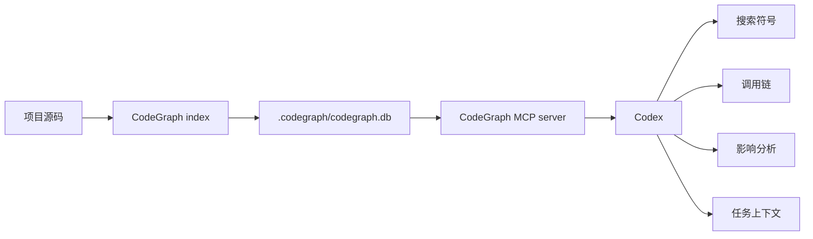

# CodeGraph + Codex MCP 配置与更新指南

## 结论

当前项目适合接入 CodeGraph，但要把它定位为“代码结构知识层”，不是完整项目知识库。

它能帮助 Codex 更快回答这些问题：

- 某个功能入口在哪里。
- 某个方法、组件、服务被谁调用。
- 修改某个符号会影响哪些模块。
- 某个需求需要先读哪些相关文件。
- 哪些测试文件可能受当前变更影响。

它不能替代这些内容：

- 产品需求、业务流程、权限含义。
- 部署环境、密钥、第三方后台配置。
- 人工架构判断和代码审查。
- `.astro` 页面本身的完整语义理解。

截至 2026-05-24，CodeGraph 官方支持 TypeScript、JavaScript、Python、Go、Rust、Java、C#、PHP、Ruby、C/C++、Swift、Kotlin、Scala、Dart、Svelte、Vue、Liquid、Pascal/Delphi、Lua、Luau 等语言，公开说明未列出 Astro。因此本项目里收益最高的区域是 `src/react-app/`、`src/pages/api/**/*.ts`、`backend/**/*.py` 这类 TS/TSX/JS/Python 文件；`.astro` 文件仍需要 Codex 在必要时直接读源码验证。

参考来源：

- CodeGraph 项目主页：https://github.com/colbymchenry/codegraph
- CLI/MCP 工具说明：https://github.com/colbymchenry/codegraph#cli-reference
- 支持语言与排障说明：https://github.com/colbymchenry/codegraph#supported-languages

## 当前项目适配性

当前仓库的快速规模判断：

| 指标 | 数量 | 含义 |
| --- | ---: | --- |
| Git 可见文件总数 | 902 | 项目已经超过轻量小项目规模 |
| TS/TSX/JS/JSX/MJS/Python 文件 | 587 | CodeGraph 可直接发挥主要价值的代码面 |
| Astro 页面文件 | 18 | 需要保守看待，必要时仍直接读文件 |

这意味着：CodeGraph 对 Marketing Center、admin、API routes、React app、工具服务层、后端 Python 模块的定位会明显有帮助；但涉及 Astro routing、布局模板和页面组合时，不能只信图谱。

## 它带来的效益

### 1. 减少重复探索成本

没有图谱时，Codex 往往需要反复执行 `rg`、`ls`、`sed`、读取多个文件，先定位功能入口，再确认调用链。CodeGraph 先把代码解析成 SQLite 图数据库，Codex 可以直接查符号、调用者、被调用者、相关上下文。

### 2. 更适合大项目里的影响分析

修改共享函数、store、service、hook、组件时，可以先用 `codegraph impact` 或 MCP 的 `codegraph_impact` 看影响半径，再决定要读哪些文件和跑哪些测试。

### 3. 对本地隐私友好

CodeGraph 的索引在本地 `.codegraph/codegraph.db`，不需要把代码上传到外部服务。它会尊重 `.gitignore`，因此 `node_modules/`、`.env`、构建产物等不会进入图谱。

### 4. 能辅助“只测受影响范围”

`codegraph affected` 可以基于 import 依赖追踪变更影响到的测试文件，适合作为后续轻量 CI 或本地验证优化的基础。

## 推荐架构



推荐原则：

- 全局只安装一次 CodeGraph MCP server。
- 每个项目单独执行 `codegraph init -i`，生成自己的 `.codegraph/`。
- `.codegraph/` 必须保持本地忽略，不提交 Git。
- 文档、业务规则、架构决策仍写入 `docs/` 或 `.trellis/spec/`。

## 一次性安装和 Codex MCP 配置

### 方式 A：推荐，已经有 `codegraph` 命令

在任意目录执行：

```bash
codegraph install --target=codex --location=global --yes
```

它会把 CodeGraph MCP server 写入 Codex 的全局配置，通常是：

```toml
[mcp_servers.codegraph]
command = "codegraph"
args = ["serve", "--mcp"]
```

然后重启 Codex，让 MCP server 重新加载。

### 方式 B：本机还没有 `codegraph`

先安装：

```bash
npm install -g @colbymchenry/codegraph
```

再配置 Codex：

```bash
codegraph install --target=codex --location=global --yes
```

最后重启 Codex。

### 方式 C：一键命令

适合新机器或新账号环境：

```bash
npm install -g @colbymchenry/codegraph
codegraph install --target=codex --location=global --yes
```

如果已经安装过 CodeGraph，只需要重复执行第二行即可修复 MCP 配置。

## 当前项目首次初始化

在当前项目根目录执行：

```bash
cd /Users/zora/WorkData/项目app/app/app-en/astro-vip-unilumin-com
codegraph init -i
codegraph status
```

预期结果：

- 项目根目录出现 `.codegraph/`。
- `.codegraph/codegraph.db` 存放本地 SQLite 图数据库。
- `codegraph status` 能看到 indexed files、symbols/nodes、edges、backend、journal 等状态。
- Codex 新会话里应能看到 CodeGraph MCP 工具。

本次实际初始化命令：

```bash
npm install -g @colbymchenry/codegraph --registry=https://registry.npmjs.org --fetch-timeout=60000 --fetch-retries=1 --loglevel=info
codegraph install --target=codex --location=global --yes
codegraph init -i
codegraph status
```

说明：

- 第一次普通 `npm install -g @colbymchenry/codegraph` 卡在 registry 响应阶段，已中止。
- 第二次显式指定 npm registry、超时和日志后安装成功。
- CodeGraph 安装器已写入 Codex 全局配置：`~/.codex/config.toml`。
- CodeGraph 安装器也更新了 `~/.codex/AGENTS.md`，为后续 Codex 会话注入 CodeGraph 使用建议。

## 日常更新方式

### 普通开发保存文件

如果 Codex MCP server 正在运行，CodeGraph 会监听项目文件变化，经过短暂防抖后自动增量同步。

### 拉取代码、切分支、合并后

建议手动执行：

```bash
codegraph sync
codegraph status
```

### 大重构、升级 CodeGraph、发现符号缺失

执行全量重建：

```bash
codegraph index --force
codegraph status
```

### 判断哪些测试受影响

```bash
git diff --name-only | codegraph affected --stdin
```

如果只想输出文件路径：

```bash
git diff --name-only | codegraph affected --stdin --quiet
```

## 在 Codex 里的使用方式

初始化后，新的 Codex 会话可以优先用 CodeGraph 做代码探索：

- `codegraph_search`：按符号名查入口。
- `codegraph_context`：按任务描述构建相关上下文。
- `codegraph_callers`：查谁调用了某函数/方法。
- `codegraph_callees`：查某函数/方法调用了谁。
- `codegraph_impact`：改某符号前看影响范围。
- `codegraph_files`：查看已索引文件结构。
- `codegraph_status`：确认图谱健康状态。

但仍要遵守两个规则：

- 对关键结论，尤其是涉及业务逻辑、权限、数据写入和安全边界时，仍要回到源码验证。
- CodeGraph 返回的是代码结构事实，不负责判断业务需求是否正确。

## 排障

### `codegraph` 命令不存在

执行：

```bash
npm install -g @colbymchenry/codegraph
```

### Codex 看不到 MCP 工具

检查：

```bash
codegraph serve --mcp
```

再检查 `~/.codex/config.toml` 是否有：

```toml
[mcp_servers.codegraph]
command = "codegraph"
args = ["serve", "--mcp"]
```

然后重启 Codex。

### 提示项目未初始化

在项目根目录执行：

```bash
codegraph init -i
```

### 缺少符号

先等几秒让 watcher 同步；如果仍缺失：

```bash
codegraph sync
```

还不行就全量重建：

```bash
codegraph index --force
```

同时确认目标文件语言是否被 CodeGraph 支持，以及是否被 `.gitignore` 排除了。

### 索引太慢

确认这些目录没有进入 Git 可见文件范围：

- `node_modules/`
- `dist/`
- `.output/`
- `.astro/`
- `.vercel/`
- `.netlify/`
- 大型外部样例代码目录

CodeGraph 会尊重 `.gitignore`；如果某些大目录被提交进 Git 且不想索引，应先加入 `.gitignore` 或移出当前项目范围。

## 本项目执行记录

首次记录时间：2026-05-24。

初始化前状态：

- 本地 `codegraph` 命令尚未存在。
- `.gitignore` 已补充 `.codegraph/`。
- Codex 全局配置已经存在其他 MCP server；新增 CodeGraph 时只需要添加 `codegraph` 这一项，不需要改动现有 MCP。

初始化后状态：

```text
CodeGraph version: 0.9.3
Project: /Users/zora/WorkData/项目app/app/app-en/astro-vip-unilumin-com
Files: 590
Nodes: 6,903
Edges: 14,988
DB Size: 20.91 MB
Backend: node:sqlite — built-in (full WAL)
Journal: wal
Index: up to date
```

节点类型分布：

| 类型 | 数量 |
| --- | ---: |
| import | 2,120 |
| function | 2,023 |
| interface | 838 |
| constant | 686 |
| file | 588 |
| method | 347 |
| type_alias | 205 |
| variable | 47 |
| class | 31 |
| enum_member | 14 |
| enum | 4 |

文件语言分布：

| 语言 | 数量 |
| --- | ---: |
| tsx | 352 |
| typescript | 220 |
| javascript | 13 |
| python | 3 |
| yaml | 2 |

`.codegraph/` 大小约 21 MB，当前只包含：

```text
.codegraph/codegraph.db
.codegraph/.gitignore
```

初步收益验证：

1. 查询 `DownloadModule` 能直接定位到 `src/react-app/download/DownloadModule.tsx:280`，并识别 `src/react-app/pages/DownloadPage.tsx` 对它的导入。
2. 查询 `marketingCase` 能一次列出 `marketingCaseDataMode.ts`、`marketingCaseLocalStore.ts`、`marketingCaseOnlineStore.ts`，并识别 `CaseStudiesTab.tsx` 到本地/线上 store 的导入关系。
3. 查询 `CaseStudiesTab` 能直接定位到 `src/react-app/admin/modules/marketing/CaseStudiesTab.tsx:105`，并识别 `src/react-app/admin/AdminPanel.tsx` 的导入。
4. `codegraph context "DownloadModule marketingCaseOnlineStore CaseStudiesTab" --max-nodes 14` 能自动组合 public Marketing Center 与 admin Case Studies 维护面的上下文，包括：
   - `DownloadModule`
   - `CaseStudiesTab`
   - `fetchAdminCaseStudyRecords`
   - `readLocalCaseStudyRecordsAsync`
   - `hydrateCaseStudyMocks`
   - `isMarketingCaseSchemaUnavailableError`
5. `codegraph files --filter src/react-app/download --max-depth 5 --format tree --no-metadata` 能直接列出下载/Marketing Center 模块的 31 个索引文件。
6. 对当前只改文档和 `.gitignore` 的 diff，`git diff --name-only | codegraph affected --stdin --quiet` 没有返回受影响测试，符合预期。

仍需注意：

- 当前 Codex 会话启动时还没有 CodeGraph MCP server，需重启 Codex 或开启新会话后才能直接使用 `codegraph_*` MCP 工具。
- CLI 已可用，当前项目 `.codegraph/` 已初始化，后续会话应直接受益。
- `.astro` 文件没有进入本次语言统计，涉及 Astro 页面结构仍要回读源码。
