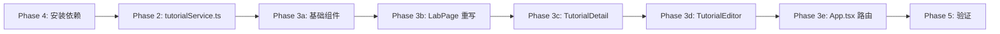

# 技术实验室 → 教程内容平台：详细实施计划

## 背景

将 `/lab` 页面从静态飞书文档引导页升级为完整的教程内容管理平台。

**核心能力**：文章发布（Tiptap 富文本）、视频嵌入（B站/YouTube）、分类标签筛选、搜索、管理员 CRUD。

---

## 当前状态审计

| 资源 | 状态 | 详情 |
|------|------|------|
| `zlcggb_tutorials` 表 | ✅ 已创建 | 20 个字段全部就位，结构与计划完全匹配 |
| `zlcggb_tutorial_series` 表 | ✅ 已创建 | 4 个字段 |
| RLS — tutorials | ✅ 已配置 | 5 条策略：公开读已发布 / 管理员读全部 / 管理员 CUD |
| RLS — series | ✅ 已配置 | 4 条策略：公开读全部 / 管理员 CUD |
| Storage 桶 `zlcggb-tutorials` | ✅ 已创建(public) | 3 条策略：公开读 / 管理员上传 / 管理员删除 |
| `profiles` 表 | ✅ 有 `role` 字段 | 用于鉴权 |
| `@supabase/supabase-js` | ✅ 已安装(2.57.4) | package.json 中已有 |
| `src/lib/supabaseClient.ts` | ✅ 已创建 | 本轮刚创建 |
| `src/lib/useAuth.ts` | ✅ 已创建 | 本轮刚创建 |
| Tiptap 依赖 | ❌ 未安装 | 需要安装 7 个包 |
| `src/lib/tutorialService.ts` | ❌ 未创建 | 数据 CRUD 服务层 |
| 前端页面组件 | ❌ 未创建 | 7 个新组件 + 2 个修改 |

---

## 用户审核项

以下确认项来自上一版计划，已标注确认结果：

1. **登录方式** → 邮箱 + 密码（Supabase Auth）✅ 已确认
2. **导航命名** → 「技术实验室」不改名 ✅ 已确认
3. **飞书链接** → 不保留飞书文档入口 ✅ 已确认
4. **预设分类** → 6 个分类 ✅ 已确认：
   - AI大模型技术 / 常用开发思路 / 网站开发逻辑 / 部署与运维 / 从业务到系统 / 从系统到架构

---

## 提议变更

### Phase 1：数据库基础设施 — ✅ 已完成

无需操作。表、RLS、Storage 桶全部到位。

---

### Phase 2：Supabase 客户端 + 数据层

#### [已完成] supabaseClient.ts

- 使用环境变量初始化，缺失时 fail-safe 抛错
- 不存储 token 到 localStorage（Supabase SDK 自行管理）

#### [已完成] useAuth.ts

- 监听 `onAuthStateChange`，查 `profiles.role` 判断 admin
- 暴露 `user` / `isAdmin` / `loading` / `signIn` / `signOut`

#### [NEW] tutorialService.ts

教程数据 CRUD 服务层，封装所有 Supabase 查询：

```typescript
// 数据类型
interface Tutorial {
  id: string;
  title: string;
  slug: string;
  content: string | null;
  content_format: 'tiptap' | 'markdown';
  excerpt: string | null;
  cover_image: string | null;
  content_type: 'article' | 'video' | 'series';
  category: string | null;
  tags: string[];
  video_url: string | null;
  is_published: boolean;
  is_featured: boolean;
  view_count: number;
  reading_time: number;
  author_id: string | null;
  series_id: string | null;
  sort_order: number;
  created_at: string;
  updated_at: string;
}

// 查询参数
interface FetchParams {
  category?: string;
  search?: string;
  page?: number;
  pageSize?: number;
}
```

**服务方法**：

| 方法 | 说明 | 安全考量 |
|------|------|---------|
| `fetchTutorials(params)` | 分页查询，支持分类/搜索筛选 | RLS 自动过滤未发布 |
| `fetchTutorialBySlug(slug)` | 根据 slug 获取单篇 | RLS 保护 |
| `fetchCategories()` | 获取已使用的分类列表 | 只查询已发布文章 |
| `createTutorial(data)` | 创建教程（管理员） | RLS 校验 admin role |
| `updateTutorial(id, data)` | 更新教程（管理员） | 同上 |
| `deleteTutorial(id)` | 删除教程（管理员） | 同上 |
| `uploadImage(file)` | 上传图片到 Storage | 文件名用 `crypto.randomUUID()` 生成，防路径遍历 |
| `incrementViewCount(id)` | 增加阅读计数 | 使用 `view_count + 1` |

**关键设计决策**：
- 搜索使用 Supabase `ilike` 对 title/excerpt 做模糊匹配（简单够用，不引入全文搜索复杂度）
- 分页用 `range()` 实现，默认 pageSize = 12
- 图片上传到 `zlcggb-tutorials` 桶，路径格式 `{uuid}.{ext}`
- 封面图 URL 存为 Supabase Storage 的公开 URL

---

### Phase 3：前端页面

#### [MODIFY] App.tsx

新增 3 条路由（使用 `React.lazy` 按需加载编辑器，减少首屏体积）：

```tsx
// 新增 import
import TutorialDetail from './components/lab/TutorialDetail';
const TutorialEditor = lazy(() => import('./components/lab/TutorialEditor'));

// 新增路由（在 <Route path="/lab" .../> 之后）
<Route path="/lab/:slug" element={<TutorialDetail />} />
<Route path="/lab/editor" element={<Suspense fallback={...}><TutorialEditor /></Suspense>} />
<Route path="/lab/editor/:id" element={<Suspense fallback={...}><TutorialEditor /></Suspense>} />
```

> `/lab` 路径下的子路由不需要修改 `_redirects`，已有的 `/* /index.html 200` 兜底规则已覆盖。

#### [MODIFY] LabPage.tsx

**完全重写**为教程列表页，保留苹果风格设计：

**结构**：
```
┌──────────────────────────────────────┐
│ Hero 区域                            │
│ - 副标题: 技术实验室                   │
│ - 主标题: 教程与文章                   │
│ - 描述文字                            │
│ - 管理员: 「发布新教程」按钮           │
├──────────────────────────────────────┤
│ SearchBar + CategoryFilter           │
├──────────────────────────────────────┤
│ ┌──────┐ ┌──────┐ ┌──────┐          │
│ │ Card │ │ Card │ │ Card │  ← 网格   │
│ └──────┘ └──────┘ └──────┘          │
│ ┌──────┐ ┌──────┐ ┌──────┐          │
│ │ Card │ │ Card │ │ Card │          │
│ └──────┘ └──────┘ └──────┘          │
├──────────────────────────────────────┤
│ 加载更多 / 空状态提示                 │
└──────────────────────────────────────┘
```

**状态管理**：
- `tutorials`: Tutorial[] — 教程列表
- `category`: string — 当前选中分类
- `search`: string — 搜索关键词（防抖 300ms）
- `page`: number — 当前页
- `hasMore`: boolean — 是否有更多数据
- `loading`: boolean — 加载状态

#### [NEW] 教程子组件目录 `src/components/lab/`

---

##### TutorialCard.tsx

教程卡片组件，在列表页中使用：

**Props**: `tutorial: Tutorial`

**UI 构成**：
- 封面图（无图时显示分类色块 + icon）
- 内容类型标记（视频用 🎬 / 文章用 📝）
- 标题 + 摘要（line-clamp）
- 底部：分类标签 + 阅读时间 + 浏览次数
- 鼠标 hover 上浮动效（沿用 `apple-card` 类）
- 点击导航到 `/lab/:slug`

**响应式**：
- 桌面 3 列网格
- 平板 2 列
- 手机 1 列

---

##### TutorialDetail.tsx

教程详情页（路由 `/lab/:slug`）：

**功能**：
- 根据 URL 中的 `slug` 获取教程数据
- 渲染 Tiptap JSON 内容（使用 `@tiptap/react` 的只读 `editor`）
- 视频教程：顶部嵌入 VideoEmbed 组件
- 页面加载时调用 `incrementViewCount`
- 管理员可见「编辑」按钮
- 标签点击回到列表页并筛选
- 上一篇/下一篇导航

**Tiptap 内容渲染**：
- 使用 `useEditor` + `EditorContent`，设置 `editable: false`
- 代码块语法高亮用 `lowlight`

**安全考量**：
- Tiptap 内容是 JSON 结构化数据，由 Tiptap 内部安全渲染，**不使用 `dangerouslySetInnerHTML`**
- 视频 URL 通过 `VideoEmbed` 组件白名单校验

---

##### TutorialEditor.tsx

Tiptap 富文本编辑器页面（管理员专用）：

**路由**：
- `/lab/editor` — 新建
- `/lab/editor/:id` — 编辑已有教程

**权限**：
- 未登录 → 显示 LoginModal
- 非 admin → 提示无权限 + 返回按钮

**编辑器工具栏**：
- 标题 (H1-H3)、加粗、斜体、删除线
- 有序/无序列表
- 代码块（`CodeBlockLowlight`）
- 引用块
- 链接插入
- 图片上传（拖拽/粘贴 → `uploadImage()`）
- 分割线

**表单字段**：
- 标题（必填）
- Slug（自动从标题生成，可手动修改）
- 分类（下拉，预设 6 个分类）
- 标签（输入后 Enter 添加）
- 摘要（textarea）
- 封面图（点击上传）
- 内容类型（article / video）
- 视频 URL（content_type = video 时显示）
- 发布状态开关
- 推荐开关

**保存逻辑**：
- 自动计算 `reading_time`（内容字数 / 400）
- content 存为 Tiptap JSON 字符串
- 保存成功后导航到详情页

**关键依赖**（需安装）：
```
@tiptap/react
@tiptap/starter-kit
@tiptap/extension-image
@tiptap/extension-link
@tiptap/extension-placeholder
@tiptap/extension-code-block-lowlight
lowlight
```

---

##### CategoryFilter.tsx

分类筛选标签栏：

**Props**：
- `categories: string[]`
- `selected: string`
- `onSelect: (category: string) => void`

**UI**：
- 水平滚动的 pill 标签，首个为「全部」
- 选中态：`bg-apple-blue text-white`
- 默认态：`bg-apple-gray-100 text-apple-gray-500`
- 切换时有 scale 微动画

---

##### SearchBar.tsx

搜索组件：

**Props**：
- `value: string`
- `onChange: (value: string) => void`

**UI**：
- 苹果风格搜索框（圆角 + 搜索图标）
- 输入时右侧显示清除按钮
- placeholder: "搜索教程..."

---

##### VideoEmbed.tsx

B站/YouTube 视频嵌入组件：

**Props**：`url: string`

**逻辑**：
- 解析 URL，识别平台：
  - B站：`bilibili.com/video/BV...` → 提取 BV 号 → `<iframe src="//player.bilibili.com/player.html?bvid=...">`
  - YouTube：`youtube.com/watch?v=...` 或 `youtu.be/...` → 提取 ID → `<iframe src="//www.youtube.com/embed/...">`
- 不支持的 URL → 显示外链按钮

**安全考量**：
- iframe `sandbox` 属性限制
- URL 白名单校验（只允许 bilibili.com / youtube.com）
- 使用 `allow="autoplay; encrypted-media"` 最小权限

---

##### LoginModal.tsx

管理员登录弹窗：

**Props**：
- `isOpen: boolean`
- `onClose: () => void`

**功能**：
- 邮箱 + 密码表单
- 调用 `useAuth().signIn`
- 错误提示（通用 "登录失败" 信息，不泄露具体原因）
- 登录成功自动关闭
- 点击遮罩层关闭
- ESC 键关闭

---

### Phase 4：依赖安装

安装 Tiptap 编辑器及相关扩展：

```bash
npm install @tiptap/react @tiptap/starter-kit @tiptap/extension-image @tiptap/extension-link @tiptap/extension-placeholder @tiptap/extension-code-block-lowlight lowlight
```

> `react-markdown` 不再需要，因为内容统一使用 Tiptap JSON 格式存储和渲染。

---

## 安全审查清单

| 检查项 | 措施 |
|--------|------|
| SQL 注入 | Supabase SDK 使用参数化查询 |
| XSS | Tiptap JSON 渲染不用 `dangerouslySetInnerHTML`；视频 URL 白名单校验 |
| 认证 | Supabase Auth 管理，不自行存储 token |
| 授权 | RLS 在数据库层面强制 admin 权限 |
| 文件上传 | UUID 重命名防路径遍历；Storage RLS 限制仅 admin 上传 |
| 密钥 | 环境变量存储，不硬编码 |
| iframe | sandbox 属性 + 白名单域名 |
| 错误信息 | 登录失败不泄露具体原因 |

---

## 执行顺序



**推荐执行路径**：
1. **先装依赖**（Phase 4）→ 确保 Tiptap 包可用
2. **tutorialService.ts**（Phase 2）→ 数据层就绪
3. **简单组件先行**：CategoryFilter → SearchBar → VideoEmbed → LoginModal → TutorialCard
4. **页面组件**：LabPage 重写 → TutorialDetail → TutorialEditor
5. **路由更新**：App.tsx
6. **验证**：typecheck → build → 本地跑通

---

## 验证计划

### 自动化验证

```bash
npm run typecheck     # TypeScript 编译检查
npm run build         # 生产构建验证
```

### 手动验证

1. **访客视角**：`/lab` → 看到教程列表 → 点击卡片 → `/lab/:slug` 详情页 → 视频播放
2. **管理员视角**：登录 → `/lab/editor` → 富文本编辑 → 上传图片 → 选分类/标签 → 发布 → 前台确认
3. **响应式**：手机端教程列表和详情页排版
4. **空状态**：无教程时的友好提示
5. **搜索/筛选**：输入关键词 → 结果即时过滤；切换分类 → 列表更新

### 安全验证

- 未登录状态访问 `/lab/editor` → 弹出登录弹窗
- 非 admin 用户登录后 → 无法看到发布按钮，编辑器提示无权限
- RLS 测试：匿名用户通过 API 直接调 insert → 被拒绝

---

## 文件变更汇总

| 操作 | 文件 | 状态 |
|------|------|------|
| DONE | `src/lib/supabaseClient.ts` | ✅ 已创建 |
| DONE | `src/lib/useAuth.ts` | ✅ 已创建 |
| NEW | `src/lib/tutorialService.ts` | ⬜ 待创建 |
| NEW | `src/components/lab/TutorialCard.tsx` | ⬜ 待创建 |
| NEW | `src/components/lab/TutorialDetail.tsx` | ⬜ 待创建 |
| NEW | `src/components/lab/TutorialEditor.tsx` | ⬜ 待创建 |
| NEW | `src/components/lab/CategoryFilter.tsx` | ⬜ 待创建 |
| NEW | `src/components/lab/SearchBar.tsx` | ⬜ 待创建 |
| NEW | `src/components/lab/VideoEmbed.tsx` | ⬜ 待创建 |
| NEW | `src/components/lab/LoginModal.tsx` | ⬜ 待创建 |
| MODIFY | `src/App.tsx` | ⬜ 待修改 |
| MODIFY | `src/components/LabPage.tsx` | ⬜ 待重写 |
| MODIFY | `package.json` | ⬜ 待更新（Tiptap 依赖） |
