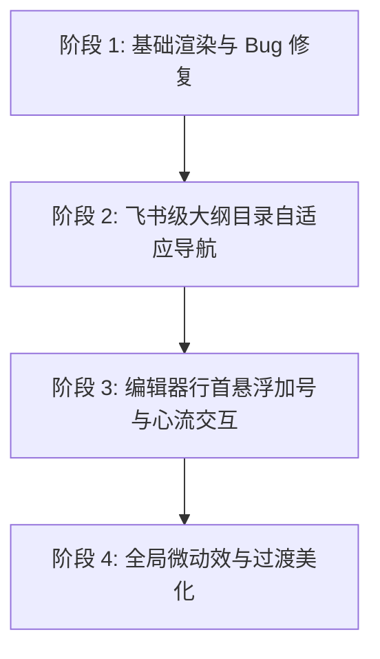

# Phase 4 补充：Tiptap 编辑器交互与排版美学优化实施记录

> **状态**：✅ 已完成并通过静态类型验证
> **归档时间**：2026-05-28
> **关联模块**：[TutorialDetail.tsx](file:///Users/zora/WorkData/项目app/app/zlcggb-home/src/components/lab/TutorialDetail.tsx), [TutorialEditor.tsx](file:///Users/zora/WorkData/项目app/app/zlcggb-home/src/components/lab/TutorialEditor.tsx), [index.css](file:///Users/zora/WorkData/项目app/app/zlcggb-home/src/index.css)

---

## 📅 阶段性实施概览

本次优化分为三个核心阶段，旨在将传统的富文本编辑器提升为具有**苹果美学**与**飞书文档级**交互的现代写作与阅读体验。



---

## 🔍 第一阶段：基础渲染竞态 Bug 修复与格式同步

本阶段主要解决只读详情页在数据载入时的空白显示问题，以及由于 Tiptap 渲染 schema 缺失导致的文本排版丢失。

### 1. 竞态渲染空白修复
*   **现象**：原详情页在获取到异步教程数据后立即调用 `editor.commands.setContent`。如果此时真实的富文本容器 DOM 尚未挂载完毕（例如骨架屏处于激活状态），填充的内容会在 DOM 挂载时被 Tiptap 默认的空状态覆盖，导致页面一片空白。
*   **解决**：将异步拉取与内容填充解耦。加载 `useEffect` 仅处理数据和骨架屏控制，新增专用同步 Effect 监听 `[editor, tutorial]`。只有在骨架屏消失且富文本 DOM 挂载就绪后，才触发 `setContent`，保证 100% 成功渲染。

### 2. 同步自定义 Schema 排版扩展
*   **现象**：编辑态设置的下划线（U）、高亮（A）及段落居中/右对齐格式，在详情阅读页由于缺少对应扩展而全部丢失。
*   **解决**：在详情页中同步手写实现了 `CustomUnderline`（下划线）、`CustomHighlight`（多色背景高亮）及 `CustomAlign`（段落与标题对齐），完美在详情阅读页还原编辑时的排版格式。

---

## 🧭 第二阶段：飞书级大纲目录自适应导航

本阶段实现详情页左侧悬浮大纲目录，提供现代化的目录大纲交互与平滑定位。

### 1. 动态标题扫描与锚点绑定
*   当教程内容渲染完毕后，通过 `requestAnimationFrame` 扫描正文所有的 `h1`, `h2`, `h3` 标题元素，并动态给它们赋予唯一的锚点 ID（`heading-0`，`heading-1` 等）。

### 2. 目录滚动高亮追踪（Scrollspy）
*   监听全局 `scroll` 事件，在用户滚动页面时，根据 `180px` 偏置像素值自动判断当前所读正文标题，并动态点亮左侧对应的大纲项。

### 3. 毛玻璃悬浮大纲 UI
*   在大屏（`xl`）下，于页面左侧固定浮现苹果风格毛玻璃大纲面板。支持点击任意标题，进行平滑（`smooth`）定位并滚动至正文。在窄屏设备上自适应隐藏。

---

## ✍️ 第三阶段：编辑器行首悬浮加号与心流交互

本阶段旨在消除传统编辑器的割裂感，提供零打扰的智能心流交互。

### 1. 空行智能探测
*   监听编辑器的选区变化，当光标落于空的 `paragraph` 节点时，自动计算该行 DOM 节点相对于编辑器的绝对 `top` 偏移，并在其行首左侧 `32px` 处动画呈出 `+` 圆圈按钮。

### 2. 防失焦斜杠激活
*   在 `+` 按钮上绑定 `onMouseDown={(e) => e.preventDefault()}` 以防止点击按钮导致编辑器失焦。
*   点击按钮会在空行行首直接插入 `/` 字符，通过链式事件无缝激活 Tiptap 的斜杠命令过滤菜单，实现无键鼠切换的极速插入体验。

### 3. “心流指南”提示卡片
*   在编辑器右侧元数据抽屉底部追加精致的苹果风格卡片，直观归纳并引导如何使用拖拽/粘贴图片、输入 ` ``` ` 插入终端代码块、`⌘K` 插入链接等高频快捷功能。

---

## 🎨 第四阶段：全局样式过渡与微动效润色

本阶段为所有交互元素赋予苹果级质感与微反馈。

### 1. 行首加号微动效 (`index.css`)
*   利用 CSS 对自定义类 `.editor-plus-btn` 进行过渡封装。鼠标悬停（Hover）时，按钮会微放大至 `1.1` 倍并顺时针旋转 `90` 度，底色转换为苹果蓝并拥有微投影；点击（Active）时伴随缩放下压回弹反馈。

### 2. 细滚动条美化
*   优化了大纲目录的滚动条，使用 `4px` 超窄透明滑轨，在保障触达度的同时杜绝视觉干扰。

---

## 🧪 验证与静态检查

项目完成上述所有阶段优化后，在项目根目录运行了完整的类型安全性验证：
```bash
npm run typecheck
```
**结果**：编译检查顺利通过，`0` 错误，`0` 警告，确认代码在富文本容器中的操作均为类型安全。
