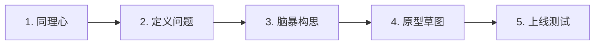

# 从 SolidWorks 到 React：个人网站的设计思维与配色美学

如果你是一名理科生（比如机械专业），当你听到“前端开发”、“网页设计”时，可能会觉得这是一门需要极强艺术细胞和复杂逻辑的玄学。但实际上，**网页设计和画 SolidWorks 装配图有着异曲同工之妙**。

在写下第一行代码之前，我们必须先解决两个终极问题：“做什么”和“为谁做”。这就是**设计思维（Design Thinking）**的起点。

---

## 一、 用工程思维解构设计：五步心法

在工业界，设计一台机器要经过需求分析、草图绘制、手板制作和上线测试。开发一个网站同样需要遵循这 5 个步骤：

### 1. 同理心 (Empathize)：用户是谁？痛点在哪？
不要自嗨，要站在访问者的角度思考。你的个人网站通常面对两类核心访客：
*   **访客 A：HR / 技术面试官**
    *   **痛点**：每天看几十份千篇一律的 PDF 简历，感到审美疲劳，且无法直观评估候选人的真实动手能力。
    *   **诉求**：他们想看你如何解决复杂问题（如无人机平台），以及你为什么用 React 而不是别的。他们需要快速验证你的“工程逻辑”。
*   **访客 B：想转行的零基础新手（同路人）**
    *   **痛点**：迷茫、焦虑，想学编程却觉得门槛太高，无从下手。
    *   **诉求**：他们需要寻找共鸣，希望能看到一个真实的跨界成功案例（如从机械转行全栈开发）和清晰的升级路线图。

### 2. 定义 (Define)：网站的核心价值是什么？
用一句话概括你网站的终极使命：
> **“构建比特（代码）与原子（实体）的桥梁，通过一个个人网站，证明我不仅具备实体设计的严谨性，还拥有虚拟世界的构建力。”**

这意味着你的网站不仅是一个冷冰冰的作品集（Portfolio），而是一个展示你跨界工程思维的“思维实验室”。

### 3. 构思 (Ideate)：三大核心板块构想
结合你的个人经历，将想法转化为具体的网站功能：
*   **板块一：实体工程美学 (Portfolio)**
    *   展示机械比赛、新冠医疗设备、无人车-无人机一体化设计。
    *   **呈现亮点**：强调实体系统设计（System Design）与软件架构的共通性。
*   **板块二：进化之路 (Storytelling Timeline)**
    *   机械图纸到写下第一个 React 组件的时间轴。
    *   **呈现亮点**：用交互式时间轴记录你思维转变的瞬间。
*   **板块三：技术实验室 (Knowledge Base)**
    *   分享自学经验，例如“Why React?”——因为 **React 的“组件化”思想与机械的“零件标准化”概念一模一样**。

### 4. 原型 (Prototype)：做个假的先试试
规划你的 MVP（最小可行性产品）结构，确定使用 `React`（组件化强） + `個人域名与服务器`（实战部署）的技术选型。

### 5. 测试 (Test)：持续反馈与优化
上线后，找非技术专业的同学试用。如果他们看不懂你的服务器部署教程，说明文字需要重写；测试图片加载速度并进行前端优化。

---

## 二、 网站配色的 3 要素与黄金法则

一个好看的网站绝对不是五彩斑斓的，它应该像一台设计精密的苹果电脑一样，色彩内敛而克制。

### 1. 颜色三要素
在网页设计中，我们通常只需要定义三种核心颜色：

| 角色 | 英文名 | 推荐占比 | 说明 |
| :--- | :--- | :--- | :--- |
| **主色** | `Primary` | **60%** | 网站的基调，通常用于按钮背景、关键标题和品牌色。 |
| **辅色** | `Secondary` | **30%** | 用于次要内容、背景板或者卡片衬底。 |
| **强调色** | `Accent` | **10%** | 用于高亮、通知、悬停反馈等需要引起注意的微小区域。 |

*   **黄金配色案例（科技感经典蓝紫调）**：
    *   主色 (Primary)：`#3c80fa`（明亮的科技蓝）
    *   辅色 (Secondary)：`#573cfa`（深邃的极客紫）
    *   强调色 (Accent)：`#b63cfa`（动感霓虹紫）

### 2. 效率色彩工具实战
千万不要凭感觉瞎选颜色，善用以下两个神奇网站：
1.  **Atmos 色轮** ([atmos.style/color-wheel](https://atmos.style/color-wheel))：在上面确定一个主色系，通过数学色轮算法，自动得出与之最契合、对比度最舒适的辅色和强调色，直接复制色号即可。
2.  **Realtime Colors** ([realtimecolors.com](https://www.realtimecolors.com/))：将复制好的色号（如 `#3c80fa`, `#573cfa`, `#b63cfa`）填入该网站，它可以让你一键在网页上**实时预览**这套颜色在导航栏、卡片和按钮上的搭配效果。

---

## 三、 本章结语

设计一个网站，首先是**理清逻辑、确认画像、敲定色系**。当你的草图和色系都准备好后，我们就可以借助现代 AI 工具，在几分钟内生成这套网站的全部代码原型。下一章我们将分享如何利用 `Bolt.new` 与本地开发工具，开启你的第一行 React 代码之旅。
