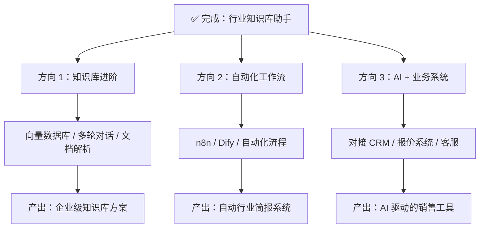

# 从零散到体系：用一个项目串联你的全部 AI 技能

你学了建站、PPT、本地模型、知识库……然后发现自己脑子里全是碎片，不知道怎么拼。别慌——**这不是你学得不好，而是缺少一条"主线任务"把零件装配起来**。

本章我们不教新技术，而是做一件事：**用一个完整项目，把你已经学过的所有东西串成一条线，做出一个"能给别人看"的成果。**

---

## 一、 为什么你觉得"乱"？一张图看清真相

先把你学过的技能摊开来：

```
你现在的脑子：

  🔧 建站    🎨 PPT    📚 大模型概念    💻 Python
     ·         ·           ·              ·
  🖥️ Ollama  🗃️ 知识库   🏢 行业知识
     ·          ·           ·

  —— 7 个散落的零件，不知道拼什么
```

**关键问题不在于"学了什么"，而在于"用来做什么"。** 想象你手里有螺丝刀、扳手、电钻、砂纸、胶水、油漆、木板——如果没有一张"要做一把椅子"的图纸，这堆工具只会让你焦虑。

现在，我给你一张图纸：

```
目标：做一个「行业 AI 知识库助手」

┌────────────────────────────────────────────────────────┐
│                                                        │
│  🏢 行业知识  ──→  🗃️ 知识库整理  ──→  🖥️ 本地模型    │
│  （你懂的东西）    （Markdown清洗）    （Ollama回答）    │
│                                                        │
│  💻 Python    ──→  📚 大模型调用  ──→  🔧 部署上线     │
│  （写胶水代码）    （API对接）       （网站/本地）      │
│                                                        │
│  🎨 PPT 技能  ──→  写教程/做演示   ──→  展示成果       │
│  （框架式指令）    （复盘输出）       （给别人看）      │
│                                                        │
└────────────────────────────────────────────────────────┘
```

**每个你学过的技能，都是这个项目中的一环。** 这就是"主线任务"的力量——它不是让你学新东西，而是让已有的知识找到位置。

---

## 二、 项目定义：你要做什么？

### 一句话定义

> **做一个能回答"你们公司 XX 产品怎么样？适合什么场景？"的本地 AI 助手。**

为什么选这个项目？因为它完美匹配你的知识储备：

| 项目环节 | 需要的能力 | 你已经会了？ |
|:---------|:----------|:----------:|
| 收集产品资料 | 行业知识 | ✅ 第 7 项 |
| 清洗为 AI 能理解的格式 | Markdown 转译 | ✅ 第 6 项 |
| 搭建本地 AI 模型 | Ollama + DeepSeek | ✅ 第 5 项 |
| 把资料喂给 AI | RAG 知识库 | ✅ 第 6 项 |
| 理解 AI 为什么这样回答 | 大模型基础概念 | ✅ 第 3 项 |
| 做一个简单的对话界面 | 建站 / 前端基础 | ✅ 第 1 项 |
| 把成果展示给别人 | PPT / 教程写作 | ✅ 第 2 项 |

**没有一项需要你从零学起。** 你只需要把散落的零件，按照图纸的顺序组装。

### 最终成果长什么样？

```
┌─────────────────────────────────────────────┐
│  🤖 洲明产品智能问答助手                       │
├─────────────────────────────────────────────┤
│                                             │
│  用户：你们的 Mini LED 显示屏适合什么场景？    │
│                                             │
│  AI：洲明科技的 Mini LED 系列主要适用于        │
│      以下场景：                               │
│      1. 指挥中心/监控室 — 超高分辨率，         │
│         长时间观看无疲劳                       │
│      2. 高端会议室 — 无缝拼接，                │
│         支持多信号源同时接入                   │
│      3. 展厅/展馆 — 超薄机身，                 │
│         前维护设计便于安装                     │
│                                             │
│      参考型号：UMini 0.9/1.2/1.5 系列         │
│                                             │
│  ┌──────────────────────────────────┐ [发送] │
│  │ 请输入你的问题...                  │       │
│  └──────────────────────────────────┘       │
└─────────────────────────────────────────────┘
```

这不是假想——你手里的工具已经足够做出这个东西。

---

## 三、 动手：四步完成项目

### 第 1 步：准备弹药 — 知识清洗（用到技能 6 + 7）

你之前已经发现了一个关键问题：**"常规 PDF 无法识别，需要用 Markdown 转译"**。这其实是 RAG 领域最核心的认知之一——数据质量决定 AI 回答质量。

> [!IMPORTANT]
> **AI 的回答质量 = 70% 数据质量 + 20% 模型能力 + 10% 提示词技巧**
>
> 你喂给它的数据越结构化、越干净，AI 的回答就越精准。这就是为什么你之前觉得"不太聪明"——不是模型笨，是"饲料"不够好。

#### 实操：从 PDF 到结构化 Markdown

假设你有一份产品手册 PDF，用以下思路转译：

```
❌ 原始 PDF 直接扔进去（AI 读到的是乱码碎片）：

  "UMini 系列 LED 显示屏 0.9mm/1.2mm/1.5mm 像素间距
   亮度 100-600nits 对比度 10000:1 刷新率 3840Hz
   前维护 碳纤维箱体 重量 7.5kg/块..."

✅ 转译为结构化 Markdown（AI 能理解上下文关系）：

  # 洲明 UMini 系列 Mini LED 显示屏

  ## 产品定位
  UMini 系列是洲明科技面向高端商业显示市场的 Mini LED 产品线，
  主打超高清、超轻薄、前维护设计。

  ## 核心参数
  | 型号 | 像素间距 | 亮度 | 对比度 | 刷新率 |
  |------|---------|------|--------|--------|
  | UMini 0.9 | 0.9mm | 100-600nits | 10000:1 | 3840Hz |
  | UMini 1.2 | 1.2mm | 100-600nits | 10000:1 | 3840Hz |
  | UMini 1.5 | 1.5mm | 100-600nits | 10000:1 | 3840Hz |

  ## 适用场景
  - **指挥中心/监控室**：超高分辨率，7×24 小时稳定运行
  - **高端会议室**：无缝拼接，多信号源同时接入
  - **展厅/展馆**：超薄机身（仅 29.5mm），前维护设计
  
  ## 竞争优势
  - 碳纤维箱体，单块仅 7.5kg，比传统方案轻 40%
  - 前维护设计，无需预留后部检修空间
```

**技巧**：你可以直接把 PDF 截图丢给 ChatGPT / DeepSeek，告诉它：

> "请将这份产品参数表转译为结构化的 Markdown 文档，包含：产品定位、核心参数表格、适用场景列表、竞争优势。"

AI 擅长做这种"格式转换"——让 AI 帮你清洗数据，然后你人工审核确认准确性。

#### 你需要准备多少数据？

```
建议的最小数据集（做 Demo 足够）：

├── 01-公司简介.md          ← 洲明概况、主营业务、行业地位
├── 02-Mini-LED-产品线.md   ← UMini 系列完整参数和场景
├── 03-商用显示-产品线.md    ← 会议/教育/零售场景产品
├── 04-常见问题-FAQ.md      ← 客户最常问的 10 个问题和标准答案
└── 05-竞品对比.md          ← 与利亚德/艾比森的核心差异点

总计 5 个文件，约 3000-5000 字 → 足够让 AI 回答 80% 的常规问题
```

> [!TIP]
> **数据量不是越多越好，而是越"结构化"越好。** 5 个精心整理的 Markdown 文件，胜过 50 个未经处理的 PDF。

---

### 第 2 步：搭引擎 — 本地模型配置（用到技能 5）

你已经装好了 Ollama + DeepSeek-R1:8B，这一步只需要确认环境正常。

#### 验证模型运行

打开终端，输入：
```bash
# 确认 Ollama 正在运行
ollama list

# 快速测试对话能力
ollama run deepseek-r1:8b "用一句话介绍什么是 Mini LED 显示屏"
```

如果能正常回答，引擎就绑好了。

#### 模型选择建议

```
你的电脑配置              推荐模型              效果
──────────────────────────────────────────────────────
8GB 内存                 deepseek-r1:8b        ⭐⭐ 基础可用
16GB 内存                deepseek-r1:14b       ⭐⭐⭐ 效果明显提升
32GB+ 内存               deepseek-r1:32b       ⭐⭐⭐⭐ 接近在线大模型
```

> [!NOTE]
> **8B 模型"不太聪明"是正常的**——它的参数量约等于一个"高中生"的知识容量。但当你给它喂了结构化的行业资料后（RAG），相当于给这个高中生发了一本"开卷考试的答案"，回答质量会显著提升。

---

### 第 3 步：装配 — 连接知识库与模型（用到技能 3 + 6）

这一步是项目的核心——把你准备好的 Markdown 文件喂给 AI，让它"带着资料回答问题"。

#### 方案 A：继续用 AnythingLLM（你已经会的）

你已经用过 AnythingLLM，这是最快的路径：

```
操作流程：

  1. 打开 AnythingLLM
  2. 创建新工作区 → 命名为"洲明产品助手"
  3. 点击 Upload → 拖入你准备好的 5 个 Markdown 文件
  4. 等待向量化完成（通常 1-2 分钟）
  5. 开始对话测试

  测试问题清单：
  ✅ "洲明的 Mini LED 有哪些型号？"        → 应能列出 UMini 系列
  ✅ "指挥中心适合用什么产品？"              → 应推荐 UMini 0.9/1.2
  ✅ "洲明和利亚德比有什么优势？"            → 应引用竞品对比文档
  ❌ "今天天气怎么样？"                    → 应回答"我只了解洲明产品相关信息"
```

> [!TIP]
> **最后一条测试很关键**——好的知识库助手应该知道自己"不知道什么"。如果它对无关问题也胡编乱造，你需要在 System Prompt 中加一句：
> "你是洲明科技的产品顾问。只回答与洲明产品相关的问题，对于无关问题请礼貌告知用户你的能力范围。"

#### 方案 B：用 Python 脚本对接 Ollama API（进阶，用到技能 4）

如果你想更深入理解 RAG 的原理，可以写一个最简单的 Python 脚本：

```python
import requests
import os

def load_knowledge_base(folder_path):
    """读取文件夹中所有 Markdown 文件作为知识库"""
    knowledge = ""
    for filename in os.listdir(folder_path):
        if filename.endswith(".md"):
            filepath = os.path.join(folder_path, filename)
            with open(filepath, "r", encoding="utf-8") as f:
                knowledge += f"\n\n--- {filename} ---\n\n"
                knowledge += f.read()
    return knowledge

def ask_ai(question, knowledge):
    """将知识库 + 问题一起发给本地模型"""
    prompt = f"""你是洲明科技的产品顾问。请根据以下参考资料回答用户的问题。
如果资料中没有相关信息，请诚实告知。

## 参考资料
{knowledge}

## 用户问题
{question}

## 你的回答"""

    response = requests.post(
        "http://localhost:11434/api/generate",
        json={
            "model": "deepseek-r1:8b",
            "prompt": prompt,
            "stream": False
        }
    )
    return response.json()["response"]

# 主程序
if __name__ == "__main__":
    print("📚 正在加载洲明产品知识库...")
    kb = load_knowledge_base("./knowledge")
    print(f"✅ 已加载知识库（{len(kb)} 字符）\n")
    
    while True:
        question = input("🙋 请输入你的问题（输入 q 退出）：")
        if question.lower() == "q":
            break
        print("\n🤖 思考中...\n")
        answer = ask_ai(question, kb)
        print(f"💡 {answer}\n")
        print("-" * 50)
```

这段代码只有 40 行，但它完整展示了 RAG 的核心原理：

```
RAG（检索增强生成）的本质：

  用户问题 ──→ ┌──────────────────────────┐
               │  把"知识库内容"拼接到     │
               │  "用户问题"前面，一起发    │ ──→ 本地模型 ──→ 回答
               │  给大模型                 │
               └──────────────────────────┘

  就这么简单。所谓 RAG，其核心就是"开卷考试"。
```

> [!IMPORTANT]
> **方案 A 和 B 选一个做就行。** 如果你对 Python 还不熟练，方案 A（AnythingLLM）完全够用——工具不是目的，做出成果才是。

---

### 第 4 步：展示 — 让成果"被看见"（用到技能 1 + 2）

做出来了，不展示，等于没做。这一步用你已有的建站和 PPT 技能，把成果包装好。

#### 输出 1：录一段演示视频（3 分钟就够）

```
视频脚本模板：

00:00 - 00:30  "大家好，我做了一个洲明产品的 AI 知识库助手"
00:30 - 01:00  演示：问一个产品参数问题 → AI 精准回答
01:00 - 01:30  演示：问一个场景推荐问题 → AI 给出建议
01:30 - 02:00  演示：问一个无关问题 → AI 拒绝回答（展示边界）
02:00 - 02:30  "这个项目用到了 Ollama、DeepSeek、Markdown 数据清洗…"
02:30 - 03:00  "如果你也想做，可以看我的教程 → 链接"
```

#### 输出 2：写一篇复盘文章

发到你的个人网站上（你已经学会建站了对吧？）。文章结构：

```
标题：我用学过的 7 个 AI 技能，做了一个行业知识库助手

一、为什么做这个？（对应你觉得"乱"的痛点）
二、用了哪些技术？（逐一对应你学过的 7 项技能）
三、遇到了什么坑？（重点讲"PDF 无法识别"和"数据清洗"）
四、最终效果展示（截图 + 对话示例）
五、下一步计划（可以往哪个方向深挖）
```

#### 输出 3：用 AI 做一份成果展示 PPT

你学过框架式指令做 PPT，现在派上用场了：

> "请用苹果风格设计一份 8 页 PPT，标题是《AI 驱动的行业知识库实战》。内容包括：项目背景、技术架构图、数据清洗流程、模型选型、演示截图、踩坑记录、未来规划、致谢。使用深色主题，强调色为 #3c80fa。"

---

## 四、 完成之后，你的技能树就清晰了

做完这个项目，再回过头看你学的东西：

```
之前（散点）：                    之后（体系）：

🔧 ·  🎨 ·  📚 ·               ┌─ 🏢 行业知识 ← 数据来源
💻 ·  🖥️ ·  🗃️ ·               ├─ 🗃️ 数据清洗 ← Markdown 转译
🏢 ·                            ├─ 🖥️ 本地模型 ← Ollama 部署
                                ├─ 📚 RAG 原理 ← 大模型概念
"我学了好多好乱"                 ├─ 💻 Python   ← 胶水脚本
                                ├─ 🔧 成果部署 ← 建站/上线
                                └─ 🎨 成果展示 ← PPT/文章
                                
                                "每个技能都有用武之地"
```

更关键的是，做完之后你能回答这个问题：

> **"你会 AI 吗？能做什么？"**
>
> "我做过一个行业 AI 知识库助手。从产品资料的 Markdown 结构化、到本地大模型的 RAG 检索、到最终部署上线，全流程自己完成。这是演示视频，这是我写的技术复盘文章。"

**这比"我学过 Ollama、知道 RAG、听过 Python 课"有说服力一万倍。**

---

## 五、 下一步往哪走？三个方向

完成了第一个项目后，你已经有了"完整交付一个 AI 应用"的经验。接下来可以选择深挖的方向：



**但那是后面的事。现在，先做完这一个项目。**

---

## 六、 本章核心心法

> [!IMPORTANT]
> **学得多不如做得完。7 个散落的技能，不如 1 个完整的项目。**
>
> 当你做完一个从"数据清洗 → 模型部署 → 知识问答 → 成果展示"的完整闭环后，你就不再是"学了一堆东西的新手"，而是"交付过 AI 项目的实践者"。
>
> 这就是从"乱"到"不乱"的唯一路径——**不是学更多，而是做完一个。**
