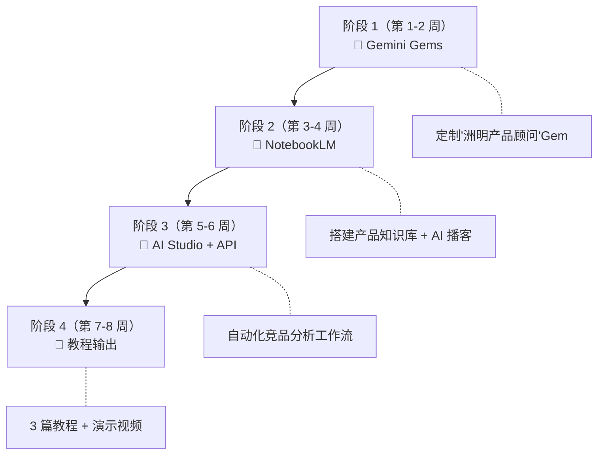

# 🚀 路径 1：AI 效率专家 — 基于 Gemini 全家桶的学习路线

> **目标身份**：能用 AI 工具显著提升个人和团队工作效率的人
> **核心工具**：Google Gemini 全家桶（Gems + NotebookLM + AI Studio + Workspace）
> **学习周期**：6-8 周（每周投入 6-10 小时）
> **前置条件**：已完成建站、Ollama 部署、AnythingLLM 初体验（✅ 全部满足）

---

## 为什么选 Gemini 全家桶？

```
  对比：零散工具 vs Gemini 生态

  以前的方式（零散工具拼凑）：
  ChatGPT + AnythingLLM + Coze + Ollama + ...
  ├── 每个工具单独注册、单独学习
  ├── 数据不互通
  └── 学了一堆，但串不起来

  Gemini 全家桶（一个账号打通）：
  ┌─────────────────────────────────────────────┐
  │  🌟 Gemini        ← 主力对话 AI              │
  │  💎 Gems          ← 定制你的专属 AI 助手       │
  │  📓 NotebookLM    ← AI 知识库 + 音频播客       │
  │  🔬 AI Studio     ← Prompt 调试 + API 开发     │
  │  📊 Workspace     ← Docs/Sheets/Slides 内嵌 AI │
  │  🔧 Antigravity   ← AI 编程助手（你正在用的）   │
  └─────────────────────────────────────────────┘
  ├── 一个 Google 账号全部打通
  ├── 数据互通（Drive → NotebookLM → Gemini）
  └── 从入门到深入，工具链完整
```

---

## 总览：四个阶段 × 四个项目



| 阶段 | 核心工具 | 项目 | 学会什么 |
|:---:|---------|------|---------|
| 1 | **Gemini Gems** | 定制「洲明产品顾问」 | Prompt Engineering |
| 2 | **NotebookLM** | 产品知识库 + AI 播客 | RAG 知识管理 |
| 3 | **AI Studio + API** | 自动化竞品分析 | API 调用 + 自动化思维 |
| 4 | **Workspace + 网站** | 教程输出 + 个人品牌 | 内容创作 + 复盘 |

---

## 阶段 1：Gemini Gems — 定制你的第一个 AI 助手（第 1-2 周）

### 什么是 Gems？

Gems 就是 Google 版的"定制 GPT"——你可以给 Gemini 设定一个固定角色、上传参考文件，然后它就变成你的专属 AI 助手，每次对话不需要重复说明背景。

### 第一步：创建你的 Gem

1. 打开 [gemini.google.com](https://gemini.google.com)
2. 左侧栏找到 **Gem manager**（宝石管理器）→ 点击 **New Gem**
3. 填写以下配置：

| 配置项 | 填什么 |
|-------|--------|
| **名称** | 洲明产品智能顾问 |
| **指令（Instructions）** | 见下方完整 System Prompt |
| **知识文件（Knowledge）** | 上传 3-5 个洲明产品 PDF/文档 |

### 第二步：写好 System Prompt

这是 Prompt Engineering 的核心。按照**三层结构**写：

```
=== 洲明产品顾问 Gem System Prompt ===

## 角色
你是洲明科技（Unilumin）的资深产品顾问，拥有 10 年 LED 显示行业经验。
你的沟通风格专业但友善，善于用通俗语言解释技术概念。

## 核心任务
1. 根据用户需求（场景、预算、尺寸）推荐合适的洲明产品型号
2. 回答产品参数、安装方式、适用场景等技术问题
3. 与利亚德、艾比森等竞品进行客观对比分析
4. 解释 LED 显示技术概念（像素间距、刷新率、亮度等）

## 回答规范
- 先用一句话给出结论，再分点展开
- 产品推荐时必须包含：型号名、像素间距、适用场景、核心优势
- 对比竞品时保持客观，不贬低对手
- 遇到不确定的参数，诚实说"建议联系洲明官方确认"
- 如果用户提供的知识文件中有答案，优先引用文件内容

## 限制
- 只回答与洲明产品、LED 显示行业相关的问题
- 不编造不存在的产品型号或虚假参数
- 对于无关问题，礼貌告知能力范围

## 输出格式
推荐产品时使用表格：
| 型号 | 像素间距 | 适用场景 | 核心优势 |
|------|---------|---------|---------|
```

### 第三步：Prompt Engineering 心法

```
三层心法（万能公式）：

  ┌─────────────────────────────────────────────┐
  │ 第一层：角色设定（你是谁）                      │
  │ → "你是 XX 行业的资深顾问..."                  │
  ├─────────────────────────────────────────────┤
  │ 第二层：任务约束（做什么 + 不做什么）             │
  │ → "当用户问 XX 时，用 XX 格式回答..."           │
  │ → "不回答 XX 类问题..."                        │
  ├─────────────────────────────────────────────┤
  │ 第三层：输出格式（怎么输出）                     │
  │ → "先总结再展开" / "用表格" / "分步骤"          │
  └─────────────────────────────────────────────┘

  这个公式可以用在任何 AI 平台，不限于 Gemini！
```

### 第四步：测试验证

做完后，逐条测试这 5 个问题：

| 测试问题 | 期望行为 | 结果 |
|---------|---------|------|
| "指挥中心适合用什么产品？" | 推荐 UMini 系列 + 表格 | ☐ |
| "洲明和利亚德比有什么优势？" | 客观对比，不贬低 | ☐ |
| "P1.2 和 P1.5 怎么选？" | 根据场景给建议 | ☐ |
| "今天天气怎么样？" | 拒绝并说明范围 | ☐ |
| "某型号的刷新率是多少？" | 引用文件或诚实说不确定 | ☐ |

### 🎁 额外项目：Gemini Workspace 集成

在 Google Docs 中用 Gemini 侧边栏：
- 打开一份产品方案文档 → 唤出 Gemini 侧边栏
- 让 Gemini 帮你优化措辞、翻译成英文、生成摘要
- **这就是"AI 效率专家"的日常工作方式**

### ✅ 阶段 1 交付标准

> - [ ] 一个能正常工作的洲明产品顾问 Gem
> - [ ] 通过 5 个测试问题的验证（截图保存）
> - [ ] 掌握 Prompt Engineering 三层公式
> - [ ] 写 200 字复盘：遇到什么问题、怎么解决的

---

## 阶段 2：NotebookLM — 搭建产品知识库 + AI 播客（第 3-4 周）

### 什么是 NotebookLM？

**NotebookLM 是 Google 推出的 AI 知识管理神器**。它和通用 AI 最大的区别：

```
  通用 AI（Gemini / ChatGPT）：
  └── 回答基于全网训练数据 → 可能编造内容（幻觉）

  NotebookLM：
  └── 回答只基于你上传的资料 → 每个回答都标注出处
      └── 还能自动生成播客！（两个 AI 主持人讨论你的资料）
```

### 第一步：创建笔记本 + 上传资料

1. 打开 [notebooklm.google.com](https://notebooklm.google.com)
2. 点击 **+ 新建笔记本**，命名为「洲明产品知识库」
3. 上传资料来源（Sources）：

```
建议上传 8-12 个文件（覆盖以下分类）：

📂 洲明产品知识库
├── 📄 公司简介.pdf          ← 洲明概况、行业地位
├── 📄 UMini系列产品手册.pdf  ← Mini LED 核心产品线
├── 📄 商用显示产品手册.pdf    ← 会议/教育/零售场景
├── 📄 户外显示产品手册.pdf    ← 户外 LED 产品线
├── 📄 指挥中心解决方案.pdf    ← 完整的行业解决方案
├── 📄 展厅展馆解决方案.pdf    ← 展示场景方案
├── 📄 常见问题FAQ.md          ← 客户最常问的 15 个问题
├── 📄 竞品对比分析.md         ← 利亚德/艾比森/海康差异
├── 🔗 洲明官网链接            ← 直接粘贴 URL
└── 🎥 产品介绍视频链接        ← YouTube/B站链接
```

> 💡 **技巧**：NotebookLM 支持直接粘贴**网页 URL 和视频链接**，不需要手动转成 PDF！

### 第二步：对话测试 — 感受"有据可查"的 AI

上传完资料后，直接在对话框问问题：

```
你："UMini 系列有哪些型号？参数分别是什么？"

NotebookLM：
"根据《UMini系列产品手册》¹，UMini 系列包含以下型号：

| 型号 | 像素间距 | 刷新率 | 适用场景 |
|------|---------|--------|---------|
| UMini 0.7 | 0.7mm | 3840Hz | 指挥中心 |
| UMini 0.9 | 0.9mm | 3840Hz | 会议室/展厅 |
| UMini 1.2 | 1.2mm | 3840Hz | 大型会议室 |

¹ 来源：UMini系列产品手册.pdf，第12页"
                                          ↑
                              每个回答都标注来源！
```

### 第三步：🎙️ 生成 AI 播客（NotebookLM 杀手级功能）

这是 NotebookLM 最酷的功能——**自动把你的资料变成一期播客节目**：

1. 在笔记本中点击右上角 **Studio**（工作室）
2. 选择 **Audio Overview**（音频概览）
3. 点击 **Generate**

```
生成结果：一段 8-15 分钟的播客音频

  🎧 两个 AI 主持人会这样讨论你的资料：

  主持人 A："今天我们来聊聊洲明科技的 UMini 系列..."
  主持人 B："对对对，我看到他们的 P0.7 产品很有意思..."
  主持人 A："你知道吗，和利亚德比起来，洲明在 XX 方面有优势..."
  主持人 B："没错！而且他们的指挥中心方案..."

  → 可以下载 MP3，通勤路上听！
  → 可以分享给同事，让不爱看文档的人也能快速了解产品
```

**这个播客可以直接发给你的客户或者同事听！**

### 第四步：对比实验

做一个 AnythingLLM vs NotebookLM 的对比：

| 维度 | AnythingLLM（阶段 2 旧方案） | NotebookLM |
|------|---------------------------|------------|
| 部署方式 | 本地安装 Ollama + AnythingLLM | 打开网页即用 |
| 数据安全 | ✅ 完全本地 | ☐ 数据在 Google 云端 |
| 回答溯源 | ❌ 不标注来源 | ✅ 每个回答标注出处 |
| 播客生成 | ❌ 不支持 | ✅ 自动生成音频播客 |
| 多源融合 | ⭐⭐ 需手动管理 | ⭐⭐⭐ 自动整合 |
| 适合场景 | 企业内部机密数据 | 产品学习/客户教育 |

> **结论：两个工具不是替代关系，而是互补。**
> - 机密数据 → 用 AnythingLLM（本地）
> - 产品学习/客户教育/团队分享 → 用 NotebookLM

### ✅ 阶段 2 交付标准

> - [ ] 一个包含 8+ 资料来源的 NotebookLM 笔记本
> - [ ] 生成一期 AI 播客并下载保存
> - [ ] 完成 AnythingLLM vs NotebookLM 对比表
> - [ ] 写 300 字复盘：两个工具各自的适用场景

---

## 阶段 3：AI Studio — 自动化工作流 + API 入门（第 5-6 周）

### 什么是 Google AI Studio？

**AI Studio 是 Gemini 的"实验室"**——你可以在这里测试 Prompt、调整参数、甚至直接生成代码和 API 调用。

```
Gemini 产品线的分工：

  Gemini（gemini.google.com）
  └── 日常对话、Gems 定制 ← 面向普通用户

  AI Studio（aistudio.google.com）
  └── Prompt 调试、API Key、代码导出 ← 面向进阶用户

  Vertex AI（cloud.google.com）
  └── 企业级部署、安全合规 ← 面向开发者/企业
```

### 项目 A：用 AI Studio 做竞品分析自动化

#### 第一步：在 AI Studio 测试 Prompt

1. 打开 [aistudio.google.com](https://aistudio.google.com)
2. 选择 **Structured Prompt**（结构化提示）
3. 配置：

```
System Instruction（系统指令）：
"你是 LED 显示行业的竞品分析专家。
用户会给你一段行业新闻或产品发布信息，
你需要从以下维度分析：
1. 涉及哪个竞品？（利亚德/艾比森/海康/其他）
2. 产品类别？（Mini LED/Micro LED/商用/户外）
3. 对洲明的影响？（高/中/低）
4. 建议的应对策略？（1-2 句话）

输出 JSON 格式：
{
  \"competitor\": \"利亚德\",
  \"category\": \"Mini LED\",
  \"impact\": \"中\",
  \"summary\": \"利亚德发布新款 P0.7 产品...\",
  \"action\": \"关注其定价策略，对比 UMini 0.7 优势\"
}"
```

4. 在输入框粘贴一条行业新闻 → 看 AI 的结构化输出
5. 调整 Temperature（创造性参数）：
   - `0.1` = 严格按格式输出（推荐）
   - `0.7` = 更灵活但可能跑偏

#### 第二步：获取 API Key

1. 在 AI Studio 右上角点击 **Get API Key**
2. 创建一个新的 API Key（免费额度足够学习使用）
3. ⚠️ **安全提醒：API Key 绝不要分享或提交到代码仓库**

#### 第三步：用 Python 调用 Gemini API

```python
# 安装：pip install google-genai
from google import genai

# 初始化客户端（API Key 从环境变量读取，不要硬编码）
import os
client = genai.Client(api_key=os.environ.get("GEMINI_API_KEY"))

# 竞品分析函数
def analyze_competitor_news(news_text: str) -> str:
    response = client.models.generate_content(
        model="gemini-2.5-flash",
        contents=news_text,
        config={
            "system_instruction": "你是 LED 显示行业竞品分析专家...",
            "temperature": 0.1,
        }
    )
    return response.text

# 使用示例
news = "利亚德发布新一代 Micro LED 0.4mm 产品，面向医疗显示市场..."
result = analyze_competitor_news(news)
print(result)
```

> 💡 **这是你第一次把 Python 基础用起来！** 之前学的 Python 入门 → 这里直接实战。

### 项目 B：Gemini in Workspace 日常效率

除了 API，Gemini 已经内嵌在 Google Workspace 里：

| 场景 | 怎么用 |
|------|--------|
| **Google Docs** | 选中一段文字 → 右键 → "Help me write" → 优化/翻译/扩写 |
| **Google Sheets** | 在单元格输入 `=GEMINI("总结这个表格的趋势")` |
| **Google Slides** | "Help me create" → 自动生成幻灯片 |
| **Gmail** | "Help me write" → 根据上下文自动草拟回复 |

### ✅ 阶段 3 交付标准

> - [ ] 在 AI Studio 中完成一个结构化 Prompt 测试
> - [ ] 获取 API Key 并用 Python 成功调用一次
> - [ ] 在 Google Docs 中用 Gemini 优化一份产品文档
> - [ ] 写 300 字复盘：API 调用的原理、自动化思维的转变

---

## 阶段 4：输出教程 + 建立个人品牌（第 7-8 周）

### 核心理念

> **学了不输出 = 没学。教别人 = 最好的自我整理。**

### 写 3 篇教程文章

| 文章标题 | 对应工具 | 目标读者 |
|---------|---------|---------|
| 「用 Gemini Gems 定制你的专属 AI 助手」 | Gems | 完全不懂 AI 的同事 |
| 「NotebookLM：让 AI 帮你读完100页产品手册」 | NotebookLM | 想提效的职场人 |
| 「从 AI Studio 到 Python API：我的第一个自动化项目」 | AI Studio | 想深入 AI 应用的人 |

**每篇文章结构模板**：

```markdown
# 标题（痛点 + 解决方案）

一句话引子

---

## 一、为什么做这个？（3 分钟读完就能共鸣）
## 二、用了什么工具？（Gemini 全家桶工具对比表格）
## 三、手把手教程（截图 + 步骤 + 关键配置）
## 四、踩过的坑（真实经验，最有价值）
## 五、最终效果展示（对话截图 / 播客试听）
## 六、下一步可以做什么（引导到下一篇）
```

### 做一个成果展示 PPT

```
8 页 PPT：「从零到一：我用 Gemini 全家桶的 60 天」

P1  封面
P2  痛点 — 学了一堆 AI 工具，串不起来
P3  解法 — Gemini 全家桶 = 一个账号打通所有场景
P4  Gems — 定制产品顾问，演示截图
P5  NotebookLM — 知识库 + AI 播客，对比数据
P6  AI Studio — API 调用，自动化分析
P7  成果数据 — 节省了多少时间？效率提升了多少？
P8  下一步 — 往产品搭建和业务系统发展
```

### ✅ 阶段 4 交付标准

> - [ ] 3 篇教程文章发布到个人网站
> - [ ] 1 份成果展示 PPT
> - [ ] 在朋友圈/同事群分享一次，收集 3 条以上反馈
> - [ ] 把 NotebookLM 生成的播客分享给至少 1 个同事

---

## 💎 Gemini 全家桶速查表

| 工具 | 网址 | 用来做什么 | 是否免费 |
|------|------|----------|---------|
| Gemini | gemini.google.com | 日常对话、Gems 定制 | ✅ 免费 / Advanced 付费 |
| NotebookLM | notebooklm.google.com | 知识库、播客生成 | ✅ 免费 |
| AI Studio | aistudio.google.com | Prompt 调试、API Key | ✅ 免费额度 |
| Workspace | docs/sheets/slides | 文档内嵌 AI | ✅ 个人版免费 |
| Antigravity | IDE 插件 | AI 编程 | 需订阅 |

---

## 完成后：通往路径 2 和 3

```
  路径 1 完成后的能力栈：
  
  ┌─────────────────────────────────────────────┐
  │  Prompt Engineering        ████████████ 90%  │
  │  Gemini 全家桶使用         █████████░░░ 80%  │
  │  RAG 知识管理              █████████░░░ 80%  │
  │  API 调用基础              ██████░░░░░░ 50%  │
  │  内容输出与展示            █████████░░░ 80%  │
  │  Python 编程              █████░░░░░░░ 40%  │
  └─────────────────────────────────────────────┘
  
  → 路径 2（AI 产品搭建）：深入 AI Studio + Vertex AI
  → 路径 3（AI + 业务系统）：API 集成 + 数据库对接
```

**做完路径 1，自然知道往哪走。先把手上的 4 个项目做出来。**

---

*制定时间：2026-06-04*
*核心工具：Google Gemini 全家桶*
*适用对象：有 AI 基础的效率提升学习者*
*配套教程：zlcggb.com 技术实验室*
