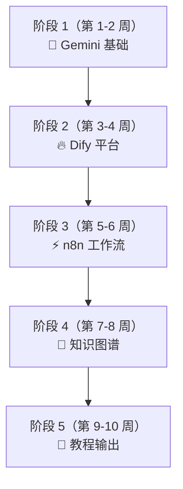

# 🚀 路径 1：AI 效率专家 — Gemini 全家桶 + 开源项目实战

> **目标身份**：能用 AI 工具 + 开源平台搭建企业级 AI 应用的人
> **核心工具**：Gemini 全家桶 + Dify + n8n + GraphRAG + RAGFlow
> **学习周期**：8-10 周（每周投入 8-12 小时）
> **前置条件**：已完成建站、Ollama 部署、AnythingLLM 初体验（✅ 全部满足）

---

## 工具全景图

```
  ┌────────────────── Gemini 生态（云端） ──────────────────┐
  │                                                         │
  │  💎 Gems           定制 AI 助手（零代码）                  │
  │  📓 NotebookLM     知识库 + AI 播客                      │
  │  🔬 AI Studio      Prompt 调试 + API Key                 │
  │  📊 Workspace      Docs/Sheets/Slides 内嵌 AI           │
  │                                                         │
  └─────────────────────────────────────────────────────────┘
                          ↕ 互通
  ┌────────────────── 开源项目（本地/私有） ─────────────────┐
  │                                                         │
  │  🔥 Dify    110k⭐  LLM 应用平台（对标定制 GPT + RAG）    │
  │  ⚡ n8n     70k⭐   自动化工作流引擎（400+ 集成）         │
  │  🧠 GraphRAG 30k⭐  知识图谱 + RAG（微软出品）            │
  │  📄 RAGFlow 20k⭐   深度文档理解 + 引用溯源               │
  │                                                         │
  └─────────────────────────────────────────────────────────┘
```

---

## 总览：五个阶段 × 五个项目



| 阶段 | 核心项目 | 开源工具 | 学会什么 |
|:---:|---------|---------|---------|
| 1 | Gemini Gems + NotebookLM | Google 产品 | Prompt Engineering + 知识管理 |
| 2 | 用 Dify 搭建 AI 客服 | **Dify** (110k⭐) | LLM 应用开发 + RAG 管线 |
| 3 | n8n 自动化工作流 | **n8n** (70k⭐) | 自动化思维 + API 集成 |
| 4 | GraphRAG 知识图谱 | **GraphRAG** (30k⭐) | 知识图谱 + 深度检索 |
| 5 | 输出教程 + 个人品牌 | 个人网站 | 内容输出 + 复盘 |

---

## 阶段 1：Gemini 全家桶入门（第 1-2 周）

> 这是热身阶段，用 Google 的云端产品快速理解 AI 效率工具的核心概念。

### 项目 1A：Gemini Gems — 定制「洲明产品顾问」

1. 打开 [gemini.google.com](https://gemini.google.com) → Gem manager → New Gem
2. 写好 System Prompt（三层结构：角色 + 任务约束 + 输出格式）
3. 上传 3-5 个洲明产品文档作为 Knowledge
4. 测试 5 个标准问题，验证效果

```
三层 Prompt 公式（万能模板）：

  ① 角色：你是 [行业] 的 [角色]，擅长 [能力]
  ② 约束：当用户问 [A] 时做 [X]，不做 [Y]
  ③ 格式：用 [表格/分步/JSON] 输出
```

### 项目 1B：NotebookLM — 产品知识库 + AI 播客

1. 打开 [notebooklm.google.com](https://notebooklm.google.com) → 新建笔记本
2. 上传 8-10 个洲明产品 PDF/文档/网页链接
3. 对话测试：每个回答都带来源标注（vs AnythingLLM 没有标注）
4. **生成 AI 播客**：Studio → Audio Overview → Generate
   - 两个 AI 主持人讨论你的产品资料
   - 下载 MP3，可以分享给同事/客户

### ✅ 阶段 1 交付

> - [ ] 一个洲明产品顾问 Gem
> - [ ] 一个 NotebookLM 笔记本 + 一期 AI 播客音频
> - [ ] 200 字复盘

---

## 阶段 2：Dify — 搭建企业级 AI 应用（第 3-4 周）

### 为什么选 Dify？

> **Dify 是目前 GitHub 最火的 LLM 应用开发平台**（110k⭐），相当于"开源版的 GPTs + RAG + 工作流"三合一。
> - GitHub: [github.com/langgenius/dify](https://github.com/langgenius/dify)
> - 官方文档: [docs.dify.ai/zh-hans](https://docs.dify.ai/zh-hans)

```
Dify vs 之前的工具：

  AnythingLLM：纯知识库问答，功能单一
  Gemini Gems：在线定制，但不能部署给团队用
  
  Dify 三合一：
  ┌─────────────────────────────────────────┐
  │  📝 Prompt IDE    ← 可视化调试提示词      │
  │  📚 RAG 知识库     ← 自带文档管理和检索    │
  │  🔄 工作流编排     ← 拖拽式 AI 工作流      │
  │  🤖 Agent 模式    ← 让 AI 自主使用工具     │
  │  🌐 一键发布      ← 生成网页/API/嵌入代码   │
  └─────────────────────────────────────────┘
```

### 第一步：本地部署 Dify

```bash
# 克隆项目
git clone https://github.com/langgenius/dify.git
cd dify/docker

# 一键启动（Docker Compose）
cp .env.example .env
docker compose up -d

# 打开浏览器
# http://localhost/install
```

> ⚠️ **前提**：电脑需要安装 Docker Desktop。如果没装过，这也是一个值得学的基础技能。

### 第二步：创建「洲明智能客服」应用

1. 进入 Dify 后台 → 创建应用 → 选择 **Chatbot（带知识库）**
2. 配置模型：
   - **在线模型**：接入 Gemini API（在 AI Studio 获取 Key）
   - **本地模型**：接入 Ollama（你已经装好了）
3. 创建知识库 → 上传洲明产品文档
4. 配置 System Prompt
5. **一键发布**：生成一个网页链接，分享给团队

### 第三步：搭建工作流（Workflow）

用 Dify 的可视化工作流搭建一个「客户需求分析器」：

```
工作流设计：

  ┌──────────┐    ┌──────────┐    ┌──────────┐    ┌──────────┐
  │ 客户输入  │ →  │ 需求分类  │ →  │ 知识库   │ →  │ 生成     │
  │ 问题文本  │    │ (LLM)    │    │ 检索     │    │ 专业回复  │
  └──────────┘    └──────────┘    └──────────┘    └──────────┘
                       │
                  产品咨询 → 推荐产品 + 参数表
                  售后问题 → 查 FAQ + 工单模板
                  竞品对比 → 对比表格 + 差异化优势
```

### ✅ 阶段 2 交付

> - [ ] 本地成功部署 Dify（Docker）
> - [ ] 创建一个接入 Gemini/Ollama 的 AI 客服应用
> - [ ] 搭建一个工作流并测试运行
> - [ ] 生成应用分享链接，发给 1 个同事体验
> - [ ] 300 字复盘：Dify vs AnythingLLM 对比

---

## 阶段 3：n8n — 自动化工作流引擎（第 5-6 周）

### 为什么选 n8n？

> **n8n 是开源自动化领域的标杆**（70k⭐），相当于"开源版 Zapier"但更强大。
> - GitHub: [github.com/n8n-io/n8n](https://github.com/n8n-io/n8n)
> - 官方文档: [docs.n8n.io](https://docs.n8n.io)

```
Dify vs n8n 的区别：

  Dify  = AI 应用平台 → "构建一个 AI 产品"
  n8n   = 通用自动化引擎 → "让多个系统自动协作"

  两者配合：
  n8n 负责调度和集成（定时触发、邮件、飞书、数据库...）
  Dify 负责 AI 能力（知识库检索、智能回复...）
  n8n 调用 Dify 的 API → 全自动 AI 工作流
```

### 第一步：本地部署 n8n

```bash
# 方式 1：Docker（推荐）
docker run -it --rm \
  --name n8n \
  -p 5678:5678 \
  -v n8n_data:/home/node/.n8n \
  n8nio/n8n

# 打开浏览器 → http://localhost:5678
```

### 第二步：搭建自动化工作流

#### 项目 A：每日行业资讯 AI 简报

```
n8n 工作流节点：

  ┌─────────┐    ┌──────────┐    ┌──────────┐    ┌─────────┐
  │ Schedule │ →  │ HTTP     │ →  │ Gemini   │ →  │ Email / │
  │ 每天8:00 │    │ 抓取RSS  │    │ API 总结  │    │ 飞书通知 │
  └─────────┘    └──────────┘    └──────────┘    └─────────┘
                      │
                 LED 行业新闻
                 竞品发布动态
                 技术趋势资讯
```

#### 项目 B：客户跟进自动化

```
n8n 工作流节点：

  ┌─────────┐    ┌──────────┐    ┌──────────┐    ┌─────────┐
  │ Webhook  │ →  │ Dify API │ →  │ IF 判断   │ →  │ 飞书/   │
  │ 接收表单  │    │ 智能分析  │    │ 紧急度    │    │ 邮件    │
  └─────────┘    └──────────┘    └──────────┘    └─────────┘
                                      │
                               高优先级 → 立即通知销售
                               中优先级 → 加入待处理队列
                               低优先级 → 自动回复模板
```

#### 项目 C：n8n + Dify 联动

```
  客户在微信/网页提问
         ↓
  n8n Webhook 接收
         ↓
  调用 Dify API 获取 AI 回复
         ↓
  n8n 记录到 Google Sheets
         ↓
  n8n 推送回复到飞书/邮件
```

### n8n 模板市场

n8n 有大量现成的工作流模板，可以直接导入修改：
- 🔗 [n8n 模板市场](https://n8n.io/workflows/) — 1000+ 现成工作流
- 搜索 "AI"、"Gemini"、"RAG" 找到相关模板

### ✅ 阶段 3 交付

> - [ ] 本地成功部署 n8n（Docker）
> - [ ] 搭建「每日 AI 简报」工作流并运行 3 天
> - [ ] 实现 n8n + Dify API 联动
> - [ ] 300 字复盘：自动化思维的转变

---

## 阶段 4：GraphRAG — 知识图谱 + 深度检索（第 7-8 周）

### 为什么学知识图谱？

```
  普通 RAG（向量检索）：
  "找到和问题最相似的文档片段" → 只看局部，不懂全局关系
  
  GraphRAG（知识图谱 + 检索）：
  "理解实体之间的关系网络" → 能回答全局性问题

  例子：
  Q: "洲明的哪些产品适合指挥中心？"
  
  普通 RAG：搜到一段提到"指挥中心"的文字 → 可能遗漏其他产品
  
  GraphRAG：
  洲明 ──生产──→ UMini 系列
          ├── UMini 0.7 ──适用──→ 指挥中心
          ├── UMini 0.9 ──适用──→ 指挥中心、会议室
          └── UMini 1.2 ──适用──→ 大型会议室
  → 完整列出所有相关产品及其关系
```

### 方案选择

| 项目 | ⭐ Stars | 特点 | 推荐程度 |
|------|---------|------|---------|
| **Microsoft GraphRAG** | 30k+ | 业界标杆，全局推理强 | ⭐⭐⭐ 首选 |
| **LightRAG** | 29k+ | 轻量高效，适合资源有限 | ⭐⭐⭐ 备选 |
| **RAGFlow** | 20k+ | 深度文档理解 + 引用溯源 | ⭐⭐ 进阶 |
| **Graphiti** | 2k+ | 时序知识图谱（Agent 记忆） | ⭐ 了解 |

### 项目：用 LightRAG 搭建洲明产品知识图谱

> 选 LightRAG 因为它**轻量、部署快、对新手友好**，同时效果接近微软 GraphRAG。

```bash
# 安装
pip install lightrag-hku

# 或者用 Docker
git clone https://github.com/HKUDS/LightRAG.git
cd LightRAG
docker compose up -d
```

```python
import os
from lightrag import LightRAG, QueryParam

# 初始化（接入 Gemini API）
rag = LightRAG(
    working_dir="./zhouming_knowledge",
    llm_model_func=...,  # 配置 Gemini API
)

# 插入洲明产品文档
with open("洲明产品手册.txt", "r") as f:
    rag.insert(f.read())

# 查询（三种模式）
# 1. naive — 简单关键词匹配
# 2. local — 局部实体检索（类似普通 RAG）
# 3. global — 全局图谱推理（GraphRAG 精髓）

result = rag.query(
    "洲明有哪些产品适合指挥中心场景？各自的核心优势是什么？",
    param=QueryParam(mode="global")
)
print(result)
```

### 效果对比

| 查询 | 普通 RAG | GraphRAG（global 模式） |
|------|---------|----------------------|
| "洲明的产品线全景？" | 只返回搜到的片段 | 完整的产品关系图 |
| "指挥中心的方案推荐？" | 可能遗漏产品 | 自动关联所有适用产品 |
| "和利亚德的核心差异？" | 单一文档片段 | 跨文档综合对比 |

### ✅ 阶段 4 交付

> - [ ] 部署 LightRAG 并导入洲明产品文档
> - [ ] 对比 naive / local / global 三种查询模式的效果
> - [ ] 生成一份知识图谱可视化截图
> - [ ] 300 字复盘：知识图谱 vs 向量检索的差异

---

## 阶段 5：教程输出 + 个人品牌（第 9-10 周）

### 输出 5 篇教程（和你 zlcggb.com 的教程风格一致）

| 序号 | 标题 | 对应工具 |
|:---:|------|---------|
| 1 | 「用 Gemini Gems 定制你的第一个 AI 助手」 | Gems |
| 2 | 「NotebookLM：让 AI 帮你读完 100 页产品手册」 | NotebookLM |
| 3 | 「零基础用 Dify 搭建企业 AI 客服」 | Dify |
| 4 | 「n8n 自动化：让 AI 每天给你发行业简报」 | n8n |
| 5 | 「GraphRAG：比普通 AI 聪明 10 倍的知识库」 | LightRAG |

### 做一份成果展示 PPT

```
10 页 PPT：「从 AI 小白到效率专家：我的 70 天实践」

P1   封面
P2   痛点 — 学了一堆工具，不知道怎么拼
P3   方案 — Gemini 全家桶 + 开源项目实战
P4   Gems + NotebookLM — 30 秒搞定产品问答
P5   Dify — 给团队搭了一个 AI 客服
P6   n8n — 每天自动收到行业简报
P7   GraphRAG — 知识图谱让 AI 不再遗漏信息
P8   数据 — 节省了多少时间？提效了多少？
P9   技术栈全景 — 一张图看清我学了什么
P10  下一步 — 往 AI 产品搭建和业务系统发展
```

### ✅ 阶段 5 交付

> - [ ] 5 篇教程发布到个人网站
> - [ ] 1 份成果 PPT
> - [ ] 1 期 NotebookLM AI 播客分享
> - [ ] 在朋友圈/同事群分享

---

## 📦 开源项目速查表

| 项目 | GitHub | ⭐ Stars | 核心能力 | 部署难度 |
|------|--------|---------|---------|---------|
| **Dify** | [langgenius/dify](https://github.com/langgenius/dify) | 110k+ | LLM 应用平台 | ⭐⭐ Docker |
| **n8n** | [n8n-io/n8n](https://github.com/n8n-io/n8n) | 70k+ | 自动化工作流 | ⭐ Docker |
| **GraphRAG** | [microsoft/graphrag](https://github.com/microsoft/graphrag) | 30k+ | 知识图谱+RAG | ⭐⭐⭐ Python |
| **LightRAG** | [HKUDS/LightRAG](https://github.com/HKUDS/LightRAG) | 29k+ | 轻量图谱RAG | ⭐⭐ Python |
| **RAGFlow** | [infiniflow/ragflow](https://github.com/infiniflow/ragflow) | 20k+ | 深度文档理解 | ⭐⭐ Docker |
| **Ollama** | [ollama/ollama](https://github.com/ollama/ollama) | 120k+ | 本地大模型运行 | ⭐ 已部署 |

---

## 学习节奏

```
  ┌────────────────────────────────────────────────┐
  │  每周 8-12 小时                                  │
  │                                                  │
  │  周一至周三：学习 + 部署                           │
  │  ├── 看官方文档 / B站教程                          │
  │  └── 跑通部署、跑通 Hello World                    │
  │                                                  │
  │  周四至周五：实战 + 调试                            │
  │  ├── 用自己的数据（洲明产品）跑项目                  │
  │  └── 遇到问题 → GitHub Issues / 社区提问            │
  │                                                  │
  │  周末：复盘 + 输出                                 │
  │  ├── 写复盘笔记                                    │
  │  └── 整理成教程草稿                                │
  │                                                  │
  │  ⚠️ 原则：每周必须有一个"能跑通"的成果              │
  └────────────────────────────────────────────────┘
```

---

## 完成后的能力栈

```
  ┌──────────────────────────────────────────────────┐
  │  Prompt Engineering         █████████████ 95%    │
  │  Gemini 全家桶使用          ██████████░░░ 85%    │
  │  RAG + 知识图谱             ████████░░░░░ 70%    │
  │  Dify / LLM 应用开发        ████████░░░░░ 70%    │
  │  n8n 自动化工作流            ████████░░░░░ 70%    │
  │  Docker 基础                ██████░░░░░░░ 50%    │
  │  Python 编程                █████░░░░░░░░ 45%    │
  │  API 调用                   ██████░░░░░░░ 55%    │
  │  内容输出与展示              █████████░░░░ 80%    │
  └──────────────────────────────────────────────────┘
  
  → 路径 2（AI 产品搭建）：深入 Dify + Vertex AI + 前端
  → 路径 3（AI + 业务系统）：n8n + 数据库 + CRM 集成
```

---

*制定时间：2026-06-04*
*核心工具：Gemini 全家桶 + Dify + n8n + LightRAG*
*适用对象：有 AI 基础、想进阶到开源实战的学习者*
