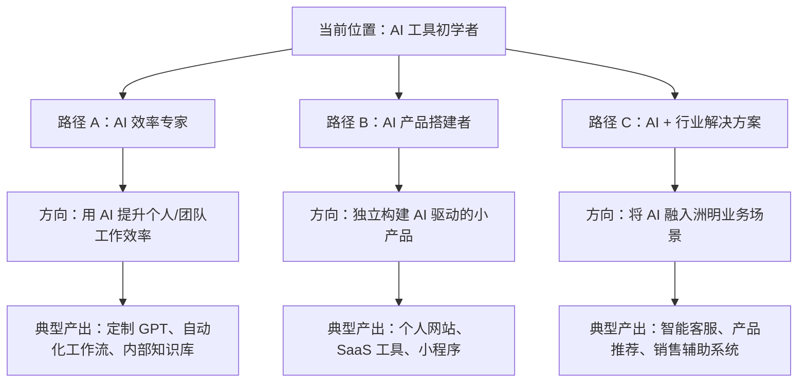

# 🧭 AI 应用学习方向分析报告

## 一、现状诊断：他学到了什么？

先把他列出的 7 项技能做一个**能力归类**，看清全景：

| 编号 | 学习内容 | 能力分类 | 深度评估 |
|:---:|---------|---------|---------|
| 1 | 多AI协作建站 + 反重力/Kiro 编辑 + 部署域名 | 🔧 AI 驱动开发 | ⭐⭐⭐ 完成了端到端闭环 |
| 2 | AI 做 PPT + 框架式指令 + SVG 基础 | 🎨 AI 内容创作 | ⭐⭐ 了解方法论，能做 |
| 3 | 大模型基础概念 | 📚 理论认知 | ⭐ 知道"是什么"，还没到"怎么用" |
| 4 | Python 基础入门 | 💻 编程基础 | ⭐ 刚入门，未形成实践 |
| 5 | Ollama + DeepSeek-R1 本地部署 | 🖥️ 本地化部署 | ⭐⭐ 能跑通流程 |
| 6 | AnythingLLM 知识库 + Markdown 转译 | 🗃️ RAG 知识管理 | ⭐⭐ 踩到了"数据质量"这个核心坑 |
| 7 | 洲明产品/企业学习 | 🏢 行业知识 | — 领域背景积累 |

## 二、核心问题：为什么觉得"乱"？

> **诊断结论：技能是散点，缺少一条「应用主线」把它们串起来。**

用一个比喻解释：

```
他现在的状态：

   🔧 建站   🎨 PPT   📚 大模型   💻 Python   🖥️ Ollama   🗃️ RAG
     ·         ·         ·          ·          ·          ·
     （6 个散落的零件，不知道拼什么）

他需要的状态：

   ┌──────────────────────────────────────────┐
   │     一个具体项目（作品/产品）               │
   │                                          │
   │   🔧 → 🎨 → 💻 → 🖥️ → 🗃️ → 🏢         │
   │   （每个技能都是这个项目中的一环）           │
   └──────────────────────────────────────────┘
```

**根本原因有三个：**

1. **学了技术，没定"用来做什么"** — 建站、PPT、本地模型都学了，但没有一个贯穿始终的业务场景把它们连起来
2. **广度先于深度** — 每样浅尝辄止（⭐ 多，⭐⭐⭐ 少），导致哪个都不能独立产出价值
3. **缺少"作品化"意识** — 学完没有产出可展示的成果，知识留在脑子里就会觉得"杂乱"

## 三、方向建议：他应该往哪走？

### 推荐方向：「AI + 行业应用」落地专家

> 不走纯技术路线（那需要计算机科班底子），而是走 **"用 AI 解决具体行业问题"** 的应用型路线。

原因很简单——他**已有的最大优势是第 7 条：洲明行业知识**。这是纯技术人不具备的。AI 时代最稀缺的不是会写代码的人，而是**懂业务 + 会用 AI 工具**的人。

### 三条可选发展路径



> [!IMPORTANT]
> **我的建议：优先走「路径 A → 逐步过渡到路径 C」**
> 
> 理由：路径 A 门槛最低、见效最快、能立刻在工作中用上。路径 C 是中期目标，需要更多编程基础。路径 D 是终极目标，但需要 A+C 的积累。

## 四、具体行动路线图

### 阶段一：聚焦 — 做一个「看得见」的作品（2-4 周）

> **核心原则：停止学新东西，把已学的东西「串成一个完整作品」**

| 任务 | 对应已有技能 | 产出 |
|------|------------|------|
| 把个人网站做完、做好 | ① 建站 + ② PPT 审美 | 一个能给别人看的个人主页 |
| 在网站上写 3 篇文章 | 整合所有学习记录 | 证明"学过且理解"的作品集 |
| 录一个 AI 建站的教程视频 | ① + ② 的经验复述 | 教别人 = 最好的自我整理 |

> [!TIP]
> **文章建议方向（和你的教程体系配套）：**
> - 「零基础如何用 AI 48 小时做出个人网站」— 对应你教程的第 1-3 章
> - 「我用 Ollama + DeepSeek 搭了个本地 AI 助手」— 对应他的第 5-6 条经验
> - 「洲明智能照明行业的 AI 应用前景」— 发挥行业优势

### 阶段二：深挖 — 选一个方向打深（1-2 个月）

从以下两个方向中**只选一个**：

#### 方向 A：RAG 知识库专精（推荐 ✅）

他已经踩过"PDF 无法识别"的坑（第 6 条），说明对数据质量有直觉了。继续深挖：

```
学习路径：
  Markdown 转译 → 结构化数据清洗 → Embedding 原理
  → 向量数据库（Supabase pgvector）→ 搭建洲明产品知识库
  → 对接客服/销售场景
```

**里程碑产出**：一个能回答"洲明 XX 产品参数是什么？适用什么场景？"的本地 AI 助手

#### 方向 B：AI 自动化工作流

用 n8n / Dify 等无代码工具搭建自动化流程：

```
学习路径：
  Dify 或 n8n 基础 → 对接大模型 API → 搭建工作流
  → 自动化日报/周报 → 自动化竞品分析
```

**里程碑产出**：一个能自动汇总行业资讯并生成简报的工作流

### 阶段三：建立体系 — 构建个人 AI 技能栈（3-6 个月）

```
                    ┌─────────────────────┐
                    │   AI 应用落地专家     │
                    │    （目标身份）       │
                    └──────────┬──────────┘
                               │
              ┌────────────────┼────────────────┐
              │                │                │
        ┌─────┴─────┐   ┌─────┴─────┐   ┌─────┴─────┐
        │  AI 工具层  │   │ 开发基础层 │   │ 行业知识层 │
        │            │   │           │   │           │
        │ · Prompt   │   │ · Python  │   │ · 洲明产品 │
        │ · RAG      │   │ · API调用  │   │ · 照明行业 │
        │ · Agent    │   │ · 数据库   │   │ · 客户需求 │
        │ · 工作流    │   │ · 前端基础 │   │ · 竞品分析 │
        └───────────┘   └───────────┘   └───────────┘
```

## 五、给你（作为导师）的教学建议

### 你的教程体系 vs 他的学习状态

| 你已写的教程 | 他的覆盖度 | 建议 |
|------------|----------|------|
| [设计思维与配色](file:///Users/zora/WorkData/项目app/app/zlcggb-home/docs/教程/website-tutorials/1-design-thinking-and-color.md) | ✅ 大致完成 | 让他基于你的框架重新审视自己的网站配色 |
| [Bolt.new 搭建 MVP](file:///Users/zora/WorkData/项目app/app/zlcggb-home/docs/教程/website-tutorials/2-bolt-new-and-local-dev.md) | ✅ 已完成 | 已掌握 |
| [Netlify 部署](file:///Users/zora/WorkData/项目app/app/zlcggb-home/docs/教程/website-tutorials/3-netlify-dns-and-env.md) | ✅ 已完成 | 已掌握 |
| [富文本编辑器](file:///Users/zora/WorkData/项目app/app/zlcggb-home/docs/教程/website-tutorials/4-rich-text-editor-and-feishu-ux.md) | ❌ 未涉及 | 暂不需要，这是进阶内容 |

### 你可以补充的教程方向

> [!IMPORTANT]
> 基于这个学生的案例，你的教程体系缺少一个**"AI 应用入门"**系列，可以考虑新增：

1. **「用 Ollama 搭建你的第一个本地 AI 助手」** — 覆盖他的第 5-6 条，体系化地讲清楚
2. **「Prompt Engineering 实战：从写指令到出成果」** — 他学了"框架式指令"但显然还没系统化
3. **「RAG 入门：让 AI 读懂你的 PDF」** — 把他踩过的坑变成教程，解决同类学生的痛点

## 六、总结：一句话给这位同学

> **不是学得乱，是缺一个「主线任务」。选一个能展示的作品，把已学的东西串进去，做完它、展示它、讲出来。能力就清晰了。**

---

*分析时间：2026-06-04*
*基于：学生自述 7 项学习内容 + zlcggb 教学体系 4 篇教程 + 7 篇已发布文章*
